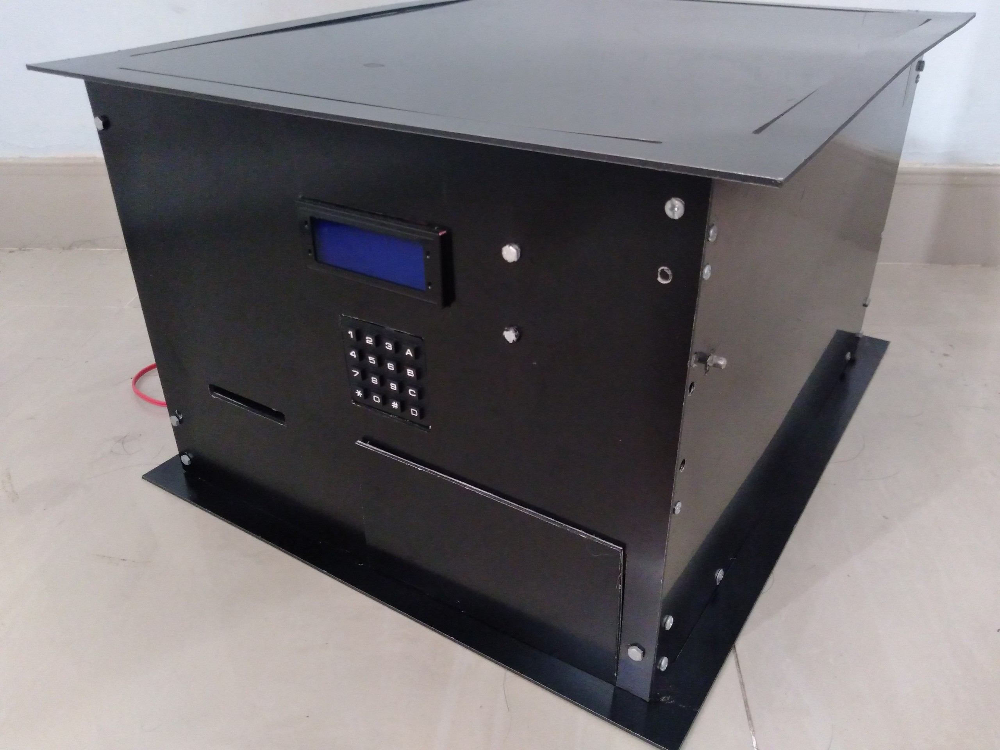
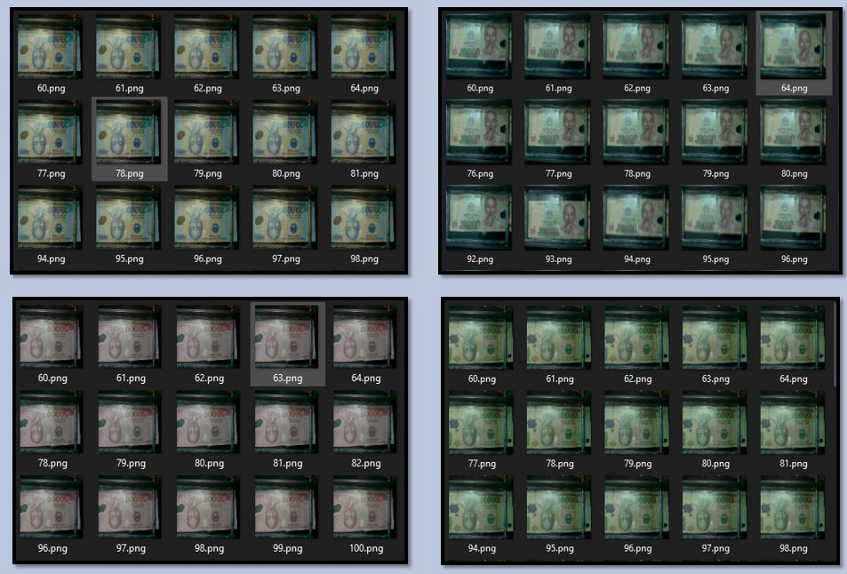
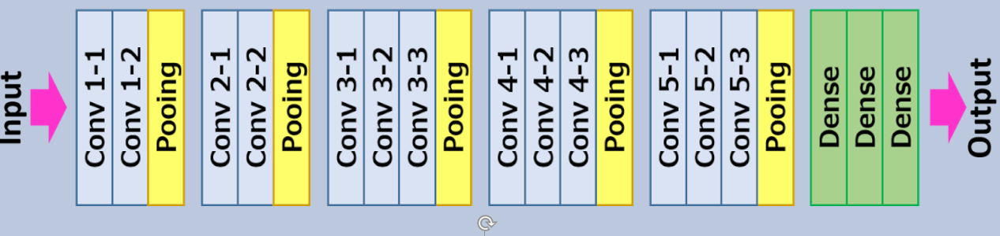
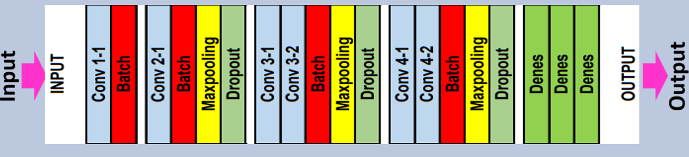

# Money
## Python3 + OpenCV + Tensorflow + Keras + VGG16 costume

=>>Click on picture to see paradigm in action<<=

 

 

This project builds a part of vending machine using Raspberry Pi 3 model B+ and open source software. Raspberry Pi collects inputs from a Pi camera,Raspberry Pi processes input images for polymer money classification. A neural network model runs on Raspberry Pi and makes predictions combined with some images processing program based on input images.

## Data Collection
 
In this project we have 18 classes

 

## VGG16

 

## VGG16 costume

